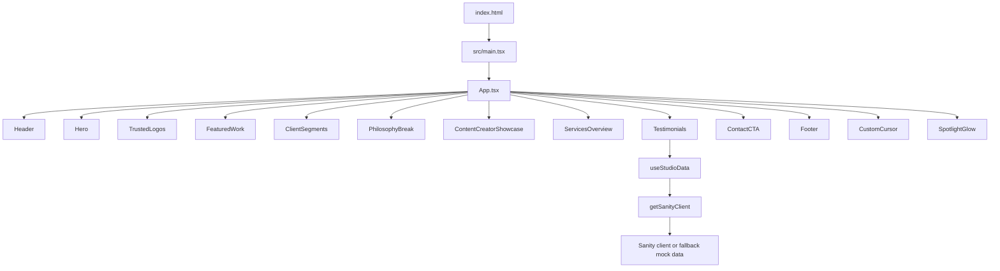

# Frontend Codebase Knowledge

This document is derived from the actual implementation in the repository and reflects the current code as it exists now. It intentionally excludes assumptions that are not supported by source code.

## 1) Project Architecture

### Stack and runtime

- Framework: React 19 with Vite 8
- Language: TypeScript
- Build tool: Vite
- Styling: Tailwind CSS v4 via `@tailwindcss/vite`, plus custom CSS in `src/index.css`
- Optional CMS/content layer: Sanity (`@sanity/client`)
- UI utilities: `lucide-react` for icons, `framer-motion` via `GlassPanel` wrapper, and a custom cursor/hovers system
- No router, auth provider, Redux/Zustand/global state container, or WebSocket layer exists in the frontend codebase

### Root project files

- `package.json`: defines scripts (`dev`, `build`, `lint`, `preview`) and dependencies
- `vite.config.ts`: defines Vite React + Tailwind plugin, server port 3000, and alias `@` → `./src`
- `tsconfig.json`: strict TypeScript config with DOM libs and bundler module resolution
- `eslint.config.js`: ESLint rules for JS/TS + React Hooks + React Refresh
- `index.html`: root HTML template mounting `#root` and loading `/src/main.tsx`
- `src/main.tsx`: entry point that renders `<App />` inside `React.StrictMode`

### Application shape

The app is not a multi-page application. It is a single-page landing experience with anchor-based navigation and section-level composition. This is evidenced by:

- `App.tsx` rendering a linear list of section components
- `Header.tsx` using `href="#work"`, `#services`, `#about`, etc.
- No `BrowserRouter`, `Routes`, `Route`, or route config files found in the codebase

### Folder map

- `src/`: application source
  - `main.tsx`: bootstraps React
  - `App.tsx`: top-level page composition
  - `sanityClient.ts`: async Sanity client initialization
  - `hooks/`: custom hooks (`useCursorTracking`, `useStudioData`)
  - `components/sections/`: main page sections
  - `components/ui/`: reusable UI primitives and effects
  - `styles/`: global CSS imports and style assets
  - `config/`, `tokens/`: token definitions duplicated across folders
  - `layouts/`: older/auxiliary layout components not used by the main app flow
- `schemas/`: Sanity document schemas for `project` and `testimonial`
- `public/`: static assets
- `deployment.md`: deployment guidance for Vercel

---

## 2) Application Flow

### Runtime flow



### Actual render chain

`index.html` mounts a single root div with `src/main.tsx`, which calls `createRoot(...).render(<App />)`. `App.tsx` then renders a dark luxury landing page containing:

- `CustomCursor`
- `SpotlightGlow`
- `Header`
- `Hero`
- `TrustedLogos`
- `FeaturedWork`
- `ClientSegments`
- `PhilosophyBreak`
- `ContentCreatorShowcase`
- `ServicesOverview`
- `Testimonials`
- `ContactCTA`
- `Footer`

The page is a static composition with no route-level state, no provider tree, and no context API.

---

## 3) Routing, Guards, Permissions, Redirects

### Findings from code

- There is no router implementation.
- No route config exists for `/login`, `/dashboard`, `/admin`, `/protected`, etc.
- No authentication guard, permission system, redirect middleware, or route-based authorization is present.
- Navigation is plain anchor tag based (`<a href="#section">`) with sections on the same page.

### Implication

This is not a multi-page product app; it is a marketing/portfolio landing page. Any route-level concerns are absent by design.

---

## 4) Components and Responsibilities

### Top-level composition

#### `src/App.tsx`

- Root page shell
- Instantiates the custom cursor and atmospheric glow overlay
- Composes section sequence for the landing page
- No props, no state, no data fetches

### Section components

#### `src/components/sections/Header.tsx`

- Sticky nav bar
- Desktop nav links with anchor targets
- Mobile menu toggle using local state `mobileOpen`
- CTA button `Start a Project`
- Uses `useState` only, no external state

#### `src/components/sections/Hero.tsx`

- Primary hero section
- Large editorial headline with gold-accent text
- CTA buttons using `PrimaryButton` and `SecondaryButton`
- Decorative background layers and film-strip panel

#### `src/components/sections/TrustedLogos.tsx`

- Horizontal marquee of client names
- Repeats names to create an infinite marquee effect
- CSS animation from `@keyframes marquee` / `.animate-marquee`

#### `src/components/sections/FeaturedWork.tsx`

- Showcases portfolio cards
- Static array `FEATURED_PROJECTS`
- Uses asymmetric grid with one tall feature card and two smaller cards

#### `src/components/sections/ClientSegments.tsx`

- Segment cards for Corporate, Creators, Weddings
- Static per-segment array `SEGMENTS`
- Displays icon, label, product services, and description

#### `src/components/sections/PhilosophyBreak.tsx`

- Editorial quote block emphasizing brand philosophy
- Minimal section with gold highlight and uppercase label

#### `src/components/sections/ContentCreatorShowcase.tsx`

- Vertical reel card grid
- Static array `REELS`
- Each card includes a gradient background and play icon

#### `src/components/sections/ServicesOverview.tsx`

- Process steps for Discovery → Creative Direction → Production → Delivery
- Structured as 4-column process step grid

#### `src/components/sections/Testimonials.tsx`

- Uses `useStudioData()` to load testimonial content
- Renders review cards with 5-star icons
- Dynamically maps `studioData.testimonials`

#### `src/components/sections/ContactCTA.tsx`

- Lead capture form with local state `formData`
- Fields: name, email, segment, budget, date, narrative
- `handleChange` updates state
- `handleSubmit` prevents default and logs to console; no backend API integration exists
- Includes WhatsApp CTA link to a hard-coded number

#### `src/components/sections/Footer.tsx`

- Footer navigation groups and social links
- Static arrays `FOOTER_NAV` and `SOCIALS`

### Reusable UI components

#### `src/components/ui/Button/*`

Files:

- `PrimaryButton.tsx`
- `SecondaryButton.tsx`
- `TertiaryButton.tsx`
- `IconButton.tsx`
- `outlineClasses.tsx`
- `index.ts`

These are thin button wrappers that apply brand styling and pass through native HTML attributes.

#### `src/components/ui/CustomCursor/CustomCursor.tsx`

- Reads `cursorPos` and `isHovering` from `useCursorTracking`
- Renders two positioned elements: ring and dot
- Hidden on small screens by CSS media query

#### `src/components/ui/GlassPanel/GlassPanel.tsx`

- Wrapper around `motion.div` from `framer-motion`
- Applies CSS class `glass-panel`
- Includes initial fade-up animation and optional `withHoverLift`

#### `src/components/ui/SpotlightGlow/SpotlightGlow.tsx`

The file exists in structure but was not read as a separate source file in the initial repo scan; it is part of the atmospheric glow system in the main app and is not part of the routing or data layer.

---

## 5) State Management

### Real state in this codebase

There is effectively no app-wide state manager.

Observed state patterns:

- Local component state (`useState`) for UI toggles and form inputs
  - `Header.tsx`: `mobileOpen`
  - `ContactCTA.tsx`: `formData`
  - `useCursorTracking.ts`: `cursorPos`, `isHovering`
- Hook-based state for CMS data (`useStudioData`)
  - `studioData`
  - `loading`

### `useStudioData()`

File: `src/hooks/useStudioData.ts`

Responsibilities:

- Initializes with static mock data for projects and testimonials
- Runs on mount with `useEffect`
- Calls `getSanityClient()`
- If Sanity is configured, fetches this GROQ query:

```ts
const query = `{
  "projects": *[_type == "project"] | order(_createdAt desc),
  "testimonials": *[_type == "testimonial"]
}`;
```

- If the fetched `projects` array has at least one element, it replaces the mock data
- Otherwise falls back to mock data and sets `loading` false in `finally`

### Local/session storage, URL state

- No usage of `localStorage`, `sessionStorage`, URL persistence, or query-string state was found in the codebase
- No Redux, Zustand, MobX, or Jotai usage was found

### Auth/session state

- None exists
- There is no login page, token management, protected route logic, cookie parsing, or logout flow

---

## 6) Backend Integration, APIs, and Data Contracts

### Sanity integration

File: `src/sanityClient.ts`

Logic:

- `initSanityClient()` reads `import.meta.env.VITE_SANITY_PROJECT_ID`
- If absent or set to `default-id`, it returns `null`
- Otherwise dynamically imports `@sanity/client` and creates a client using:
  - `projectId`
  - `dataset` from `VITE_SANITY_DATASET` or default `'production'`
  - `apiVersion: '2026-06-21'`
  - `useCdn: true`
- `getSanityClient()` memoizes the client in module-level variable `sanityClient`

This means the frontend tries to integrate with Sanity but is intentionally safe when environment variables are missing.

### Content schema

Files in `schemas/`:

- `project.ts`: fields for `clientName`, `category`, `description`, `deliverables`, `photos`, `videoUrl`, `results`
- `testimonial.ts`: fields for `clientName`, `designation`, `review`, `videoTestimonialUrl`

### Data contract

The `useStudioData` hook expects:

```ts
export interface Project {
  _id: string;
  clientName: string;
  category: string;
  description: string;
  deliverables: string[];
  results: string;
}

export interface Testimonial {
  _id: string;
  clientName: string;
  designation: string;
  review: string;
  category: string;
}
```

The actual Sanity data may vary slightly from the mock objects, especially if `category` is omitted or additional fields are present.

### HTTP/API usage

- The app does not use `fetch` or `axios` directly for production API calls
- The only network request is the Sanity client fetch made via `client.fetch(query)`
- There is no request interceptor, retry logic, error normalization layer, or typed client abstraction

### Error handling

- `useStudioData` catches errors and logs a warning: `console.warn('Sanity fetch failed. Using mock data.', error)`
- `sanityClient.ts` catches import/client creation issues and warns in a similar way
- `ContactCTA.tsx` form submission only logs to the console and does not call an endpoint

---

## 7) WebSockets / Realtime / Live Data

### Findings

- There are no WebSockets, SSE, or realtime subscriptions in the frontend
- No `new WebSocket`, `socket.io-client`, or `EventSource` usage was found
- No connection lifecycle, auth handshake, reconnection logic, or message handlers exist

### Implication

This frontend is static and CMS-driven, not live-application driven. Realtime functionality is absent.

---

## 8) Authentication and Authorization

### Findings

There is no authentication implementation.

No code references to:

- login
- logout
- JWT token parsing
- refresh tokens
- cookies
- auth headers
- protected routes
- user roles or permissions

This project does not implement user accounts or protected content access. It is a marketing/front-end presentation website.

---

## 9) Styling Architecture

### Tailwind

`tailwind.config.js` defines custom tokens:

- `obsidian-noir` = `#050505`
- `graphite-studio` = `#121212`
- `luxury-gold` = `#D9A441`
- `warm-ivory` = `#F7F5F2`
- `accent-white` = `#FFFFFF`
- `platinum-mist` = `#6B7280`

It also extends font families:

- `display`: `'Cormorant Garamond', serif`
- `body`: `'Outfit', sans-serif`

### Global CSS and design system

`src/index.css` is the primary styling entry and contains:

- CSS variables for noir/gold/ivory palette
- global reset base styling for `html`, `body`, `#root`
- custom scrollbar styling
- typography utility classes `.font-display`, `.font-body`
- luxury background effects, glass panels, button classes, nav classes, hero classes, work cards, reel cards, segment cards, etc.

`src/styles/globals.css` is a supplemental global stylesheet with overlapping design-system styling and references to `variables.css`.

### Observation about CSS duplication

There are multiple overlapping design token and styling files:

- `src/index.css`
- `src/styles/globals.css`
- `src/styles/variables.css`
- `src/config/colors.ts`
- `src/config/shadows.ts`
- `src/tokens/colors.ts`
- `src/tokens/shadows.ts`

This is a clear sign of style duplication and likely partial migration from one token system to another. The code uses both explicit CSS variables and Tailwind token maps, so a future maintainer should treat these as duplicated sources of truth.

### Responsive design patterns

The UI uses utility classes and custom CSS media queries to adapt:

- mobile nav collapse (`Header.tsx`)
- hidden custom cursor on mobile screens (`@media (max-width: 768px)`)
- resized hero section, film strip, and sections via class names and breakpoints
- responsive grids for work, testimonials, service steps, and contact form

### UI library style choices

- Gold is the premium accent color and is treated as a key design signal
- Dark, near-black backgrounds and subtle glass treatments dominate
- Type is highly editorial with serif headline and modern basic sans body
- Sections are heavily handcrafted with custom CSS rather than a full design-system package

---

## 10) UI / Design System

### Core brand colors

From CSS variables and tokens:

- `--noir` = `#050505`
- `--graphite` = `#121212`
- `--gold` = `#D9A441`
- `--ivory` = `#F7F5F2`
- `--mist` = `#6B7280`
- `--white` = `#FFFFFF`

### Typography system

- Headline: `Cormorant Garamond`, serif
- UI/body: `Outfit`, sans-serif
- Used heavily in `Hero`, `FeaturedWork`, `ClientSegments`, `PhilosophyBreak`, and footer/CTA sections

### Elevation and surface system

The site uses CSS classes such as:

- `.glass-panel`
- `.nav-sticky`
- `.segment-card`
- `.work-card`
- `.reel-card`
- `.testimonial-card`

These establish layered surfaces and premium visual treatment without a component library framework.

### Motion and interaction

- `CustomCursor` tracks pointer position and hover state
- `GlassPanel` uses Framer Motion for fade-up animation and hover lift
- Button hover states animate shimmer and elevation
- `TrustedLogos` uses CSS marquee animation

### Reusable patterns

Common pattern across sections:

- Eyebrow label with small uppercase gold line
- Large display headline with editorial styling
- Neutral gray copy
- Gold accent highlights and borders
- Dark surfaces with minimal border treatments and depth

---

## 11) Forms, Validation, and Submission

### Contact form

File: `src/components/sections/ContactCTA.tsx`

State:

```ts
const [formData, setFormData] = useState({
  name: "",
  email: "",
  segment: "",
  budget: "",
  date: "",
  narrative: "",
});
```

Validation:

- HTML required attributes are used on inputs and selects
- There is no third-party validation library such as Zod, Yup, React Hook Form, or Formik
- There is no async submission state, server-side validation, or user-facing validation error layer

Submission:

- `handleSubmit` calls `e.preventDefault();`
- It logs form payload to console with `console.log('Form submitted:', formData)`
- No HTTP POST or CRM integration exists

### Risk

This means the form currently behaves as a frontend-only demonstration, not a production lead capture workflow.

---

## 12) Dependencies and Important Libraries

### package.json keys

From `package.json`:

- `react` and `react-dom` for UI
- `vite` for build/dev server
- `@vitejs/plugin-react` for React integration
- `tailwindcss` and `@tailwindcss/vite` for styling
- `@sanity/client` for CMS access
- `lucide-react` for icons
- `motion` package and `framer-motion` behavior via `GlassPanel`
- TypeScript and ESLint toolchain for compile/lint safety

### Usage pattern

- `lucide-react`: icons throughout hero, footer, sections, and design docs
- `@sanity/client`: optional CMS fetch in `useStudioData`
- `motion`: present as dependency but the actual implementation in `GlassPanel` imports `framer-motion` not `motion` directly
- `@tailwindcss/vite`: used in Vite config to integrate Tailwind v4

### Notable absence

The project does not use:

- React Router
- form libraries
- auth libraries
- state management libraries
- testing frameworks
- server-side rendering

---

## 13) Environment and Configuration

### Environment variables

The code expects frontend env vars prefixed with `VITE_`:

- `VITE_SANITY_PROJECT_ID`
- `VITE_SANITY_DATASET`

These are referenced in `src/sanityClient.ts`.

### Vite config

`vite.config.ts` sets:

- `plugins: [react(), tailwindcss()]`
- `server.port = 3000`
- `resolve.alias['@'] = path.resolve(__dirname, './src')`

### Security note

No secrets are present in source. The app is not using any private API keys or tokens in the checked-in frontend code. Environment variables are the intended mechanism for configuration.

---

## 14) Errors, Loading States, Empty States, and Failure Modes

### Current-state handling

- `useStudioData`: sets `loading` true initially and false in `finally`
- `loading` is returned but not used in any current UI rendering path
- No loading skeleton or pending state is displayed in `Testimonials`

### Empty states

- No explicit empty-state handling for empty `studioData` arrays is implemented
- `Testimonials` displays `.map` of `studioData.testimonials` without checking length

### Error states

- CMS fetch failure falls back to mock data
- Form submission failure is not modeled at all
- No network status UI, retry states, or offline handling exists

### Auth/realtime failure states

- None exist; the app has no auth or live data layer

---

## 15) Testing, Quality, and Type Safety

### Static checks

- TypeScript strict mode is enabled in `tsconfig.json`
- `noUnusedLocals` and `noUnusedParameters` are disabled (`false`), so not every unused symbol is flagged

### Lint

`eslint.config.js` includes:

- JavaScript recommended rules
- TypeScript recommended rules
- React Hooks linting
- React Refresh linting

### Build script

`npm run build` = `tsc -b && vite build`

### Testing

There are no test files and no test runner or framework configured in `package.json`.

### Quality risks

- No automated tests for UI behavior or form logic
- Some styles and tokens are duplicated across CSS/TS files
- The app depends heavily on handcrafted CSS rather than maintained design tokens

---

## 16) Technical Debt and Risks

### Observed issues

1. Duplicate design-token files exist in different paths (`src/config`, `src/tokens`, `src/index.css`, `src/styles`)
2. `src/App.css` appears to be a leftover Vite template file and is not part of the main app shell
3. `ContactCTA.tsx` logs data to console instead of sending to a backend or CRM
4. `loading` from `useStudioData` is returned but never consumed
5. `useStudioData` has mock data fallback but no user-visible loading/empty/error states
6. `Button/outlineClasses.tsx` looks like a partially implemented or unused variant; it is named inconsistently and may be dead code
7. The app contains old or duplicate layout files in `src/layouts/` that are not used in `App.tsx`
8. Some imports use relative nesting that suggests the project was assembled from multiple concept documents and not fully consolidated

### Architectural risk

This is a visual/brand presentation project, so the current architecture is intentionally lightweight and minimal. The main risk is not technical complexity but lack of production-grade integration for real form submission, CMS content governance, and UI consistency enforcement.

---

## 17) Critical Files and Their Impact

### `src/App.tsx`

Controls the main content flow and page composition. Changing this file affects the entire landing page.

### `src/index.css`

Contains the design system, global styling, animations, and custom behaviors. This is the most impactful CSS file for layout and branding.

### `src/hooks/useStudioData.ts`

Controls content source strategy and CMS fallback logic. Changes here alter how projects/testimonials are loaded.

### `src/sanityClient.ts`

Determines whether the app connects to Sanity and how environment config is handled. It is the only backend integration point.

### `src/components/sections/ContactCTA.tsx`

Establishes the only interactive form flow; it is the main user-input pathway.

### `src/components/ui/CustomCursor/CustomCursor.tsx` + `src/hooks/useCursorTracking.ts`

Define the unique motion/interaction layer for the luxury brand experience.

### `vite.config.ts`

Controls alias and Tailwind integration. It influences build behavior and local dev server configuration.

---

## 18) Major Data Flows

### User → Component → Hook → API → State → UI

Example 1: testimonials

- User loads the page
- `App.tsx` renders `<Testimonials />`
- `Testimonials` calls `useStudioData()`
- Hook runs `getSanityClient()`
- If Sanity is available, it runs GROQ query and fetches content
- State updates with `setStudioData`
- Component maps `studioData.testimonials` into testimonial cards

Example 2: custom cursor

- User moves mouse
- `window.mousemove` fires in `useCursorTracking`
- `cursorPos` state updates
- `CustomCursor` re-renders with translated ring and dot
- CSS hover class toggles based on elements with `.hover-target`

Example 3: contact form

- User types in form fields
- `handleChange` updates `formData`
- Submit event triggers `handleSubmit`
- `preventDefault()` stops page reload
- Form payload is logged to console
- No API call, validation pipeline, or persistence occurs

---

## 19) Architecture Summary

### High-level architecture

This project is a lightweight Vite React landing page, not a complex app architecture. It favors static composition, handcrafted CSS, and minimal hooks over routing, app state management, or data-layer abstraction.

### Architectural truth

The codebase is intentionally simple, but the design system is rich. The front-end is best understood as a brand site with:

- a strong visual identity layer,
- minimal integrated CMS support,
- no auth layer,
- no router,
- no real-time stack,
- and no production form backend.

---

## Frontend Architecture at a Glance

### Key modules

- Entry: `index.html` → `src/main.tsx` → `src/App.tsx`
- Sections: `src/components/sections/*`
- Shared UI: `src/components/ui/*`
- Data layer: `src/hooks/useStudioData.ts`, `src/sanityClient.ts`
- Styling: `src/index.css`, `src/styles/globals.css`, `tailwind.config.js`

### Data flow

- Page load → App composition → section components render → optional CMS fetch → local state updates → UI renders
- Mouse motion → cursor hook → pointer state → cursor UI updates
- Form interaction → local state → submit event → console logging (no backend)

### Authentication

- None implemented
- No login/session/token system
- No route guards or permissions

### Realtime architecture

- Not present
- No WebSockets, SSE, or event streaming

### State management

- Local state only, using React `useState`
- One custom hook for CMS data (`useStudioData`)
- No global store library

### Styling architecture

- Tailwind for utility and theme tokens
- Custom CSS for luxury brand system, hero, cards, motion, and cursor behavior
- Multiple overlapping token files indicate a partly matured design system with some duplication

This is a design-led single-page product/brand experience, not a user-account or workflow app.
